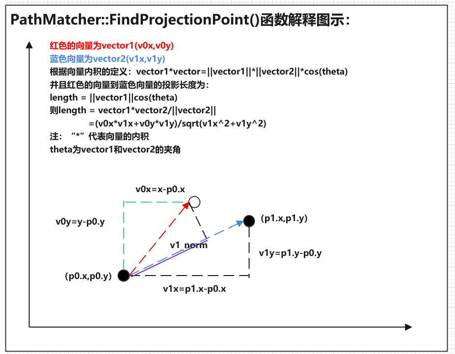

# Lattice-Planning
TEST
关于从2021年8月14号开始，通过命令行git push提交不上，只能用token提交的问题：[git push报错，必须用token提交的方法](https://blog.csdn.net/weixin_41010198/article/details/119698015)
增加了matlab2020b增加的使用lattice planning的源码HighwayTrajectoryPlanningUsingFrenetReferencePathExample，后续进行学习时添加相关备注和学习文档
大体花了几天看了一遍代码，还是比较复杂的，但是感觉也有很多不太好理解的地方还有一些不太合理的。
后续把仿真的脉络学习一下，自己往里面写代码实现填充，把matlab当作一个编程和仿真的工具。
后续一些算法方法往里面填充


# Apollo Lattice Planning

## 一、概况

步骤：

1. 离散化参考线的点

2. 在参考线上计算匹配点

3. 根据匹配点，计算Frenet坐标系的S-L值

4. 计算障碍物的s-t图

5. 生成横纵向采样路径

6. 计算cost值，进行碰撞检测

7. 优选出cost值最小的trajectory

### 1.1 离散化参考线的点

完成的功能：获取reference line并把它转换为PathPoint格式

计算reference line的s值

```cpp
//lattice_planner.cc
// 1. obtain a reference line and transform it to the PathPoint format.
  auto ptr_reference_line =
      std::make_shared<std::vector<PathPoint>>(ToDiscretizedReferenceLine(
          reference_line_info->reference_line().reference_points()));
```

> std::make_shared,C++11中引入智能指针，模板函数std::make_shared可以返回一个制定类型的std::shared_ptr，当成个指针用就行
>
> std::make_shared初始化的优点，shared_ptr需要维护引用计数的信息，记录当前有多少个存活的shared_ptr正持有该对象...
>
> 参考链接：[C++11 make_shared](https://www.jianshu.com/p/03eea8262c11)

> PathPoint:查到的定义是在pnc_point.pb.h文件里，好像这个是和ros里的msg是类似的，通过pnc_point.proto可以生成pnc_point.pb.h文件，就像ros里的pnc_point.msg生成pnc_point.h。
>
> pnc_point.proto的Apollo路径：/modules/common/proto/pnc_point.proto
>
> 定义了：
>
> SLPoint:(s,l)
>
> FrenetFramePoint:(s,l,dl,ddl)
>
> SpeedPoint:(s,t,v[speed,m/s],a[acceleration,m/s2],da[jerk,m/s3])
>
> PathPoint:(x,y,z,theta,kappa,s,dkppa,ddkppa,lane_id,x_derivative,y_derivative)
>
> Path:(name,path_point[])
>
> TrajectoryPoint:(path_point,v,a,relative_time,da,steer,gaussian_info)
>
> Trajectory:(name trajectory_point[])
>
> VehicleMotionPoint:(trajectory_point,steer)
>
> VehicleMotion:(name,vehicle_motion_point[])
>
> GaussianInfo:(sigma_x,sigma_y,correlation,area_probability,ellipse_a,ellipseb,theta_a)

> reference_line_info:是什么？
>
> 文件路径：/modules/planning/common/reference_line_info.h和reference_line_info.cc
>
> 文件挺长啊，包含的函数很多，有几十个，几乎包含了reference line的所有操作
>
> 

#### ToDiscretizedReferenceLine()函数：

函数功能：从参考线中逐个提取x,y,theta,kappa,dkappa，并计算累加的s值，赋给path_points

```cpp
std::vector<PathPoint> ToDiscretizedReferenceLine(
    const std::vector<ReferencePoint>& ref_points) {
  double s = 0.0;
  std::vector<PathPoint> path_points;
  for (const auto& ref_point : ref_points) {
    PathPoint path_point;
    path_point.set_x(ref_point.x());
    path_point.set_y(ref_point.y());
    path_point.set_theta(ref_point.heading());
    path_point.set_kappa(ref_point.kappa());
    path_point.set_dkappa(ref_point.dkappa());
    
     //path_points为从ref_points逐个获取参考点，填入path_points中path_points.back()可以理解为上一个参考点path_points[i-1]
    if (!path_points.empty()) {
      double dx = path_point.x() - path_points.back().x();
      double dy = path_point.y() - path_points.back().y();
      s += std::sqrt(dx * dx + dy * dy);
    }
    path_point.set_s(s);
    path_points.push_back(std::move(path_point));
  }
  return path_points;
}
```

> vector.back():返回最末一个元素
>
> 参考链接：[vector向量back()函数运用实例](https://zouzhongliang.com/index.php/2019/07/22/vectorxiangliangbackhanshuyunyongshili/)

> std::move()：C++11中增加的函数，相比于直接用path_points.push_back(path_point)，可以通过std::move避免不必要的拷贝操作，std::move是将对象的状态所有权从一个对象转移到另一个对象，只是转移，没有内存的搬迁或者内存拷贝，所以可以提高利用效率，改善性能。
>
> 参考链接：[c++ 之 std::move 原理实现与用法总结](https://blog.csdn.net/p942005405/article/details/84644069/)

### 1.2在参考线上计算匹配点

完成的功能：在初始化的参考线上计算匹配点

```cpp
// 2. compute the matched point of the init planning point on the reference
  // line.
  PathPoint matched_point = PathMatcher::MatchToPath(
      *ptr_reference_line, planning_init_point.path_point().x(),
      planning_init_point.path_point().y());
```

> planning_init_point，这个初始点是从哪来的？是获取的车辆当前点吗？

> ptr_reference_line是1.1步骤得到的参考线路径点

#### PathMatcher::MatchToPath():

函数功能：

函数路径：/modules/common/math/path_matcher.cc

函数解释：

问题：

```cpp
PathPoint PathMatcher::MatchToPath(const std::vector<PathPoint>& reference_line,
                                   const double x, const double y) {
  CHECK_GT(reference_line.size(), 0U);
//1.通过计算planing_init_point点到参考path上所有的点的欧式距离（直线距离），找出参考path上最近的点的index
  auto func_distance_square = [](const PathPoint& point, const double x,
                                 const double y) {
    double dx = point.x() - x;
    double dy = point.y() - y;
    return dx * dx + dy * dy;
  };

  double distance_min = func_distance_square(reference_line.front(), x, y);
  std::size_t index_min = 0;

  for (std::size_t i = 1; i < reference_line.size(); ++i) {
    double distance_temp = func_distance_square(reference_line[i], x, y);
    if (distance_temp < distance_min) {
      distance_min = distance_temp;
      index_min = i;
    }
  }

  std::size_t index_start = (index_min == 0) ? index_min : index_min - 1;
  std::size_t index_end =
      (index_min + 1 == reference_line.size()) ? index_min : index_min + 1;

  if (index_start == index_end) {
    return reference_line[index_start];
  }

  return FindProjectionPoint(reference_line[index_start],
                             reference_line[index_end], x, y);
}
```

> index_min,index_start,index_end的关系：画图示意一下


#### PathMatcher::FindProjectionPoint():

实现功能：找到查找点到参考路径的投影点，根据找到的参考路径上的最近点的前后点，插值得到查找点在参考路径上的s

函数路径：/modules/common/math/path_matcher.cc

函数解释：白色点为查找点，两个黑色点为插值点index_start和index_end（起始就是投影，利用index_start和index_end这两个点作为一条直线，把查找点向这个直线去做投影，起始也就是为了插值）



问题：

```cpp
PathPoint PathMatcher::FindProjectionPoint(const PathPoint& p0,
                                           const PathPoint& p1, const double x,
                                           const double y) {
  double v0x = x - p0.x();
  double v0y = y - p0.y();

  double v1x = p1.x() - p0.x();
  double v1y = p1.y() - p0.y();

  double v1_norm = std::sqrt(v1x * v1x + v1y * v1y);
  double dot = v0x * v1x + v0y * v1y;

  double delta_s = dot / v1_norm;
  return InterpolateUsingLinearApproximation(p0, p1, p0.s() + delta_s);
}
```


#### InterpolateUsingLinearApproximation()

实现功能：通过线性插值返回该点投影到参考线上的信息，包括x,y,theta,kappa,dkappa,ddkppa和s

函数路径：/modules/common/math/linear_interpolation.cc

函数解释：高精地图上的点不仅具有x,y坐标，还会有速度、加速度、到达该点的时间、转向角。。。高精地图需要有这么多信息吗？？？？

问题：

需要注意，有三个InterpolateUsingLinearApproximation()，另外两个分别是：

SLPoint InterpolateUsingLinearApproximation(const SLPoint &p0,                                            const SLPoint &p1, const double w) 

和

TrajectoryPoint InterpolateUsingLinearApproximation(const TrajectoryPoint &tp0,const TrajectoryPoint &tp1,const double t)

注意传入的参数是不同的，返回值也不一样。。。。

```cpp
PathPoint InterpolateUsingLinearApproximation(const PathPoint &p0,
                                              const PathPoint &p1,
                                              const double s) {
  double s0 = p0.s();
  double s1 = p1.s();

  PathPoint path_point;
  double weight = (s - s0) / (s1 - s0);
  double x = (1 - weight) * p0.x() + weight * p1.x();
  double y = (1 - weight) * p0.y() + weight * p1.y();
  double theta = slerp(p0.theta(), p0.s(), p1.theta(), p1.s(), s);
  double kappa = (1 - weight) * p0.kappa() + weight * p1.kappa();
  double dkappa = (1 - weight) * p0.dkappa() + weight * p1.dkappa();
  double ddkappa = (1 - weight) * p0.ddkappa() + weight * p1.ddkappa();
  path_point.set_x(x);
  path_point.set_y(y);
  path_point.set_theta(theta);
  path_point.set_kappa(kappa);
  path_point.set_dkappa(dkappa);
  path_point.set_ddkappa(ddkappa);
  path_point.set_s(s);
  return path_point;
}
```

#### lerp()

实现功能：线性插值

函数路径：/modules/common/math/linear_interpolation.h

函数解释：简单的线性插值,x=x0+ (t - t0) / (t1 - t0)*(x1 - x0)

问题：

```cpp
template <typename T>
T lerp(const T &x0, const double t0, const T &x1, const double t1,
       const double t) {
  if (std::abs(t1 - t0) <= 1.0e-6) {
    AERROR << "input time difference is too small";
    return x0;
  }
  const double r = (t - t0) / (t1 - t0);
  const T x = x0 + r * (x1 - x0);
  return x;
}
```

#### slerp()

实现功能：专门是用于角度的线性插值，线性原理和lerp()相同，但是会正则化角度范围到[-M_PI,M_PI].

函数路径：/modules/common/math/linear_interpolation.cc

函数解释：

问题：

```cpp
double slerp(const double a0, const double t0, const double a1, const double t1,
             const double t) {
  if (std::abs(t1 - t0) <= kMathEpsilon) {
    ADEBUG << "input time difference is too small";
    return NormalizeAngle(a0);
  }
  const double a0_n = NormalizeAngle(a0);
  const double a1_n = NormalizeAngle(a1);
  double d = a1_n - a0_n;
  if (d > M_PI) {
    d = d - 2 * M_PI;
  } else if (d < -M_PI) {
    d = d + 2 * M_PI;
  }

  const double r = (t - t0) / (t1 - t0);
  const double a = a0_n + d * r;
  return NormalizeAngle(a);
}
```

#### NormalizeAngle()

实现功能：将角度正则化到[-M_PI,M_PI]范围内。

函数路径：/modules/common/math/math_utils.cc

函数解释：

问题：

```cpp
double NormalizeAngle(const double angle) {
  double a = std::fmod(angle + M_PI, 2.0 * M_PI);
  if (a < 0.0) {
    a += (2.0 * M_PI);
  }
  return a - M_PI;
}
```

### 1.3 根据匹配点，计算Frenet坐标系的S-L值

```cpp
// 3. according to the matched point, compute the init state in Frenet frame.
  std::array<double, 3> init_s;
  std::array<double, 3> init_d;
  ComputeInitFrenetState(matched_point, planning_init_point, &init_s, &init_d);

  ADEBUG << "ReferenceLine and Frenet Conversion Time = "
         << (Clock::NowInSeconds() - current_time) * 1000;
  current_time = Clock::NowInSeconds();

  auto ptr_prediction_querier = std::make_shared<PredictionQuerier>(
      frame->obstacles(), ptr_reference_line);
```

#### ComputeInitFrenetState():

实现功能：根据参考线上的匹配点把全局笛卡尔坐标系的点转换到Frenet坐标系,转换的s和d，及其一阶和二阶导数，通过ptr_s和ptr_d传出

函数路径：/modules/planning/planner/lattice/lattice_planner.cc

函数解释：

问题：

```cpp
void ComputeInitFrenetState(const PathPoint& matched_point,
                            const TrajectoryPoint& cartesian_state,
                            std::array<double, 3>* ptr_s,
                            std::array<double, 3>* ptr_d) {
  CartesianFrenetConverter::cartesian_to_frenet(
      matched_point.s(), matched_point.x(), matched_point.y(),
      matched_point.theta(), matched_point.kappa(), matched_point.dkappa(),
      cartesian_state.path_point().x(), cartesian_state.path_point().y(),
      cartesian_state.v(), cartesian_state.a(),
      cartesian_state.path_point().theta(),
      cartesian_state.path_point().kappa(), ptr_s, ptr_d);
}
```

#### CartesianFrenetConverter::cartesian_to_frenet():

实现功能：笛卡尔坐标系转换成Frenet的计算公式,转换完的s和d的各阶导数通过指针ptr_s_condition(s,s'(t),s''(t))和ptr_d_condition(d,d'(s),d''(s))传出.

函数路径：/modules/common/math/cartesian_frenet_conversion.cc

函数解释：参考[cartesionToFrenet_MicrosoftOneNoteOnline.pdf](docs/cartesionToFrenet_MicrosoftOneNoteOnline.pdf)和[cartesian_to_frenet的公式和代码对应分析](src/Apollo_cartesian_to_frenet/ReadMe.md)

问题：

```cpp
void CartesianFrenetConverter::cartesian_to_frenet(
    const double rs, const double rx, const double ry, const double rtheta,
    const double rkappa, const double rdkappa, const double x, const double y,
    const double v, const double a, const double theta, const double kappa,
    std::array<double, 3>* const ptr_s_condition,
    std::array<double, 3>* const ptr_d_condition) {
  const double dx = x - rx;
  const double dy = y - ry;

  const double cos_theta_r = std::cos(rtheta);
  const double sin_theta_r = std::sin(rtheta);

  const double cross_rd_nd = cos_theta_r * dy - sin_theta_r * dx;
  ptr_d_condition->at(0) =
      std::copysign(std::sqrt(dx * dx + dy * dy), cross_rd_nd);

  const double delta_theta = theta - rtheta;
  const double tan_delta_theta = std::tan(delta_theta);
  const double cos_delta_theta = std::cos(delta_theta);

  const double one_minus_kappa_r_d = 1 - rkappa * ptr_d_condition->at(0);
  ptr_d_condition->at(1) = one_minus_kappa_r_d * tan_delta_theta;

  const double kappa_r_d_prime =
      rdkappa * ptr_d_condition->at(0) + rkappa * ptr_d_condition->at(1);

  ptr_d_condition->at(2) =
      -kappa_r_d_prime * tan_delta_theta +
      one_minus_kappa_r_d / cos_delta_theta / cos_delta_theta *
          (kappa * one_minus_kappa_r_d / cos_delta_theta - rkappa);

  ptr_s_condition->at(0) = rs;

  ptr_s_condition->at(1) = v * cos_delta_theta / one_minus_kappa_r_d;

  const double delta_theta_prime =
      one_minus_kappa_r_d / cos_delta_theta * kappa - rkappa;
  ptr_s_condition->at(2) =
      (a * cos_delta_theta -
       ptr_s_condition->at(1) * ptr_s_condition->at(1) *
           (ptr_d_condition->at(1) * delta_theta_prime - kappa_r_d_prime)) /
      one_minus_kappa_r_d;
}
```

#### class PredictionQuerier

实现功能：预测查询器

函数路径：/modules/planning/lattice/behavior/prediction_querier.h和.cpp

函数解释：

问题：

```cpp
class PredictionQuerier {
 public:
  PredictionQuerier(const std::vector<const Obstacle*>& obstacles,
                    const std::shared_ptr<std::vector<common::PathPoint>>&
                        ptr_reference_line);

  virtual ~PredictionQuerier() = default;

  std::vector<const Obstacle*> GetObstacles() const;

  double ProjectVelocityAlongReferenceLine(const std::string& obstacle_id,
                                           const double s,
                                           const double t) const;

 private:
  std::unordered_map<std::string, const Obstacle*> id_obstacle_map_;

  std::vector<const Obstacle*> obstacles_;

  std::shared_ptr<std::vector<common::PathPoint>> ptr_reference_line_;
};
```

#### PredictionQuerier::PredictionQuerier():

实现功能：预测查询器的构造函数，传入障碍物信息和参考线

函数路径：/modules/planning/lattice/behavior/prediction_querier.cpp

函数解释：

- 输入：obstacles，
- 输入：ptr_reference_line，

问题：

```cpp
PredictionQuerier::PredictionQuerier(
    const std::vector<const Obstacle*>& obstacles,
    const std::shared_ptr<std::vector<common::PathPoint>>& ptr_reference_line)
    : ptr_reference_line_(ptr_reference_line) {
  for (const auto ptr_obstacle : obstacles) {
    if (common::util::InsertIfNotPresent(&id_obstacle_map_, ptr_obstacle->Id(),
                                         ptr_obstacle)) {
      obstacles_.push_back(ptr_obstacle);
    } else {
      AWARN << "Duplicated obstacle found [" << ptr_obstacle->Id() << "]";
    }
  }
}

```


> Obstacle,障碍物数据类，感觉有点决策的感觉呢，再学学，信息量比较大。。。。。。。。。。。。。。。。。
>
> 类的路径：/modules/planning/common/obstacle.h
>
> ××××××××××××××××××××××××××××××××××××××××××××××××××××××××××××
>
> 简介：这是一个将Obstacle与其路径属性关联起来的类。障碍物相对于路径的路径属性。s和l是路径属性的例子。
>
> 障碍物的决策也和路径相关，决策分为两类：横向决策和纵向决策。
>
> 横向决策包括：nudge(轻推，可理解为向一侧稍微挪动)和ignore(忽视)，且优先级是nudge>ignore。
>
> 纵向决策包括：stop>yield(让行)>=follow>overtake(超车)>ignore
>
> ignore决策优先级最低。
>
> ××××××××××××××××××××××××××××××××××××××××××××××××××××××××××
>
> CreateObstacles(const prediction::PredictionObstacles& predictions);
>
> 这个函数可以从预测数据中创建障碍，对于每个障碍，最初的预测可能有多个轨迹，但是这个函数会为每个轨迹创造一个障碍
>
> ×××××××××××××××××××××××××××××××××××××××××××××××××××××××××××
>
> ObjectDecisionType& LateralDecision() const;
>
> 返回横向决策（nudge,ignore）
>
> ×××××××××××××××××××××××××××××××××××××××××××××××××××××××××
>
> ObjectDecisionType& LongitudinalDecision() const;
>
> 返回纵向决策（stop、yield、follow、overtake、ignore）

### 1.4 计算障碍物的s-t图

解析决策并获得规划目标

```cpp
// 4. parse the decision and get the planning target.
//1.构建S-T图
  auto ptr_path_time_graph = std::make_shared<PathTimeGraph>(
      ptr_prediction_querier->GetObstacles(), *ptr_reference_line,
      reference_line_info, init_s[0],
      init_s[0] + FLAGS_speed_lon_decision_horizon, 0.0,
      FLAGS_trajectory_time_length, init_d);
//2.获取巡航速度，并设定Lattice巡航车速
  double speed_limit =
      reference_line_info->reference_line().GetSpeedLimitFromS(init_s[0]);
  reference_line_info->SetLatticeCruiseSpeed(speed_limit);
//3.获取参考线上的规划目标，看看是否有停止点
  PlanningTarget planning_target = reference_line_info->planning_target();
  if (planning_target.has_stop_point()) {
    ADEBUG << "Planning target stop s: " << planning_target.stop_point().s()
           << "Current ego s: " << init_s[0];
  }

  ADEBUG << "Decision_Time = "
         << (Clock::NowInSeconds() - current_time) * 1000;
  current_time = Clock::NowInSeconds();
```

> 构建S-T图的代码需要好好看看，这里是比较核心的内容

> reference_line_info->planning_target()是都包含多少中规划目标，看一下
>
> reference_line_info包含的函数和信息太多了，另外放一个文档专门将reference line info：[ReferenceLineInfo类介绍](docs/reference_line_info.md)

