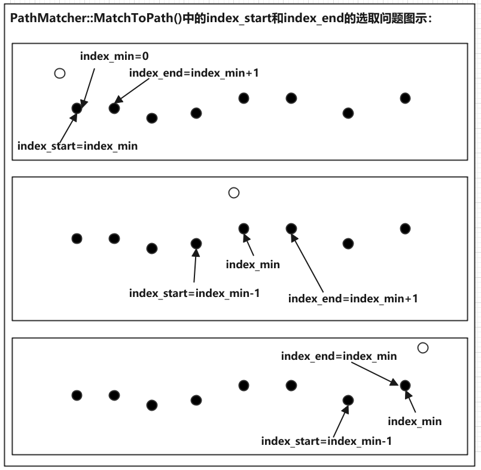

# Lattice-Planning
TEST
关于从2021年8月14号开始，通过命令行git push提交不上，只能用token提交的问题：[git push报错，必须用token提交的方法](https://blog.csdn.net/weixin_41010198/article/details/119698015)
增加了matlab2020b增加的使用lattice planning的源码HighwayTrajectoryPlanningUsingFrenetReferencePathExample，后续进行学习时添加相关备注和学习文档
大体花了几天看了一遍代码，还是比较复杂的，但是感觉也有很多不太好理解的地方还有一些不太合理的。
后续把仿真的脉络学习一下，自己往里面写代码实现填充，把matlab当作一个编程和仿真的工具。
后续一些算法方法往里面填充


# Apollo Lattice Planning

## 一、概况

步骤：

1. 离散化参考线的点

2. 在参考线上计算匹配点

3. 根据匹配点，计算Frenet坐标系的S-L值

4. 计算障碍物的s-t图

5. 生成横纵向采样路径

6. 计算cost值，进行碰撞检测

7. 优选出cost值最小的trajectory

### 1.1 离散化参考线的点

完成的功能：获取reference line并把它转换为PathPoint格式

计算reference line的s值

```cpp
//lattice_planner.cc
// 1. obtain a reference line and transform it to the PathPoint format.
  auto ptr_reference_line =
      std::make_shared<std::vector<PathPoint>>(ToDiscretizedReferenceLine(
          reference_line_info->reference_line().reference_points()));
```

> std::make_shared,C++11中引入智能指针，模板函数std::make_shared可以返回一个制定类型的std::shared_ptr，当成个指针用就行
>
> std::make_shared初始化的优点，shared_ptr需要维护引用计数的信息，记录当前有多少个存活的shared_ptr正持有该对象...
>
> 参考链接：[C++11 make_shared](https://www.jianshu.com/p/03eea8262c11)

> PathPoint:查到的定义是在pnc_point.pb.h文件里，好像这个是和ros里的msg是类似的，通过pnc_point.proto可以生成pnc_point.pb.h文件，就像ros里的pnc_point.msg生成pnc_point.h。
>
> pnc_point.proto的Apollo路径：/modules/common/proto/pnc_point.proto
>
> 定义了：
>
> SLPoint:(s,l)
>
> FrenetFramePoint:(s,l,dl,ddl)
>
> SpeedPoint:(s,t,v[speed,m/s],a[acceleration,m/s2],da[jerk,m/s3])
>
> PathPoint:(x,y,z,theta,kappa,s,dkppa,ddkppa,lane_id,x_derivative,y_derivative)
>
> Path:(name,path_point[])
>
> TrajectoryPoint:(path_point,v,a,relative_time,da,steer,gaussian_info)
>
> Trajectory:(name trajectory_point[])
>
> VehicleMotionPoint:(trajectory_point,steer)
>
> VehicleMotion:(name,vehicle_motion_point[])
>
> GaussianInfo:(sigma_x,sigma_y,correlation,area_probability,ellipse_a,ellipseb,theta_a)

> reference_line_info:是什么？
>
> 文件路径：/modules/planning/common/reference_line_info.h和reference_line_info.cc
>
> 文件挺长啊，包含的函数很多，有几十个，几乎包含了reference line的所有操作
>
> 

#### ToDiscretizedReferenceLine()函数：

函数功能：从参考线中逐个提取x,y,theta,kappa,dkappa，并计算累加的s值，赋给path_points

```cpp
std::vector<PathPoint> ToDiscretizedReferenceLine(
    const std::vector<ReferencePoint>& ref_points) {
  double s = 0.0;
  std::vector<PathPoint> path_points;
  for (const auto& ref_point : ref_points) {
    PathPoint path_point;
    path_point.set_x(ref_point.x());
    path_point.set_y(ref_point.y());
    path_point.set_theta(ref_point.heading());
    path_point.set_kappa(ref_point.kappa());
    path_point.set_dkappa(ref_point.dkappa());
    
     //path_points为从ref_points逐个获取参考点，填入path_points中path_points.back()可以理解为上一个参考点path_points[i-1]
    if (!path_points.empty()) {
      double dx = path_point.x() - path_points.back().x();
      double dy = path_point.y() - path_points.back().y();
      s += std::sqrt(dx * dx + dy * dy);
    }
    path_point.set_s(s);
    path_points.push_back(std::move(path_point));
  }
  return path_points;
}
```

> vector.back():返回最末一个元素
>
> 参考链接：[vector向量back()函数运用实例](https://zouzhongliang.com/index.php/2019/07/22/vectorxiangliangbackhanshuyunyongshili/)

> std::move()：C++11中增加的函数，相比于直接用path_points.push_back(path_point)，可以通过std::move避免不必要的拷贝操作，std::move是将对象的状态所有权从一个对象转移到另一个对象，只是转移，没有内存的搬迁或者内存拷贝，所以可以提高利用效率，改善性能。
>
> 参考链接：[c++ 之 std::move 原理实现与用法总结](https://blog.csdn.net/p942005405/article/details/84644069/)

### 1.2在参考线上计算匹配点

完成的功能：在初始化的参考线上计算匹配点

```cpp
// 2. compute the matched point of the init planning point on the reference
  // line.
  PathPoint matched_point = PathMatcher::MatchToPath(
      *ptr_reference_line, planning_init_point.path_point().x(),
      planning_init_point.path_point().y());
```

> planning_init_point，这个初始点是从哪来的？是获取的车辆当前点吗？

> ptr_reference_line是1.1步骤得到的参考线路径点

#### PathMatcher::MatchToPath():

函数功能：

函数路径：/modules/common/math/path_matcher.cc

函数解释：

问题：

```cpp
PathPoint PathMatcher::MatchToPath(const std::vector<PathPoint>& reference_line,
                                   const double x, const double y) {
  CHECK_GT(reference_line.size(), 0U);
//1.通过计算planing_init_point点到参考path上所有的点的欧式距离（直线距离），找出参考path上最近的点的index
  auto func_distance_square = [](const PathPoint& point, const double x,
                                 const double y) {
    double dx = point.x() - x;
    double dy = point.y() - y;
    return dx * dx + dy * dy;
  };

  double distance_min = func_distance_square(reference_line.front(), x, y);
  std::size_t index_min = 0;

  for (std::size_t i = 1; i < reference_line.size(); ++i) {
    double distance_temp = func_distance_square(reference_line[i], x, y);
    if (distance_temp < distance_min) {
      distance_min = distance_temp;
      index_min = i;
    }
  }

  std::size_t index_start = (index_min == 0) ? index_min : index_min - 1;
  std::size_t index_end =
      (index_min + 1 == reference_line.size()) ? index_min : index_min + 1;

  if (index_start == index_end) {
    return reference_line[index_start];
  }

  return FindProjectionPoint(reference_line[index_start],
                             reference_line[index_end], x, y);
}
```

> index_min,index_start,index_end的关系：画图示意一下



#### PathMatcher::FindProjectionPoint():

实现功能：找到查找点到参考路径的投影点，根据找到的参考路径上的最近点的前后点，插值得到查找点在参考路径上的s

函数路径：/modules/common/math/path_matcher.cc

函数解释：白色点为查找点，两个黑色点为插值点index_start和index_end（起始就是投影，利用index_start和index_end这两个点作为一条直线，把查找点向这个直线去做投影，起始也就是为了插值）


问题：

```cpp
PathPoint PathMatcher::FindProjectionPoint(const PathPoint& p0,
                                           const PathPoint& p1, const double x,
                                           const double y) {
  double v0x = x - p0.x();
  double v0y = y - p0.y();

  double v1x = p1.x() - p0.x();
  double v1y = p1.y() - p0.y();

  double v1_norm = std::sqrt(v1x * v1x + v1y * v1y);
  double dot = v0x * v1x + v0y * v1y;

  double delta_s = dot / v1_norm;
  return InterpolateUsingLinearApproximation(p0, p1, p0.s() + delta_s);
}
```


#### InterpolateUsingLinearApproximation()

实现功能：通过线性插值返回该点投影到参考线上的信息，包括x,y,theta,kappa,dkappa,ddkppa和s

函数路径：/modules/common/math/linear_interpolation.cc

函数解释：高精地图上的点不仅具有x,y坐标，还会有速度、加速度、到达该点的时间、转向角。。。高精地图需要有这么多信息吗？？？？

问题：

需要注意，有三个InterpolateUsingLinearApproximation()，另外两个分别是：

SLPoint InterpolateUsingLinearApproximation(const SLPoint &p0,                                            const SLPoint &p1, const double w) 

和

TrajectoryPoint InterpolateUsingLinearApproximation(const TrajectoryPoint &tp0,const TrajectoryPoint &tp1,const double t)

注意传入的参数是不同的，返回值也不一样。。。。

```cpp
PathPoint InterpolateUsingLinearApproximation(const PathPoint &p0,
                                              const PathPoint &p1,
                                              const double s) {
  double s0 = p0.s();
  double s1 = p1.s();

  PathPoint path_point;
  double weight = (s - s0) / (s1 - s0);
  double x = (1 - weight) * p0.x() + weight * p1.x();
  double y = (1 - weight) * p0.y() + weight * p1.y();
  double theta = slerp(p0.theta(), p0.s(), p1.theta(), p1.s(), s);
  double kappa = (1 - weight) * p0.kappa() + weight * p1.kappa();
  double dkappa = (1 - weight) * p0.dkappa() + weight * p1.dkappa();
  double ddkappa = (1 - weight) * p0.ddkappa() + weight * p1.ddkappa();
  path_point.set_x(x);
  path_point.set_y(y);
  path_point.set_theta(theta);
  path_point.set_kappa(kappa);
  path_point.set_dkappa(dkappa);
  path_point.set_ddkappa(ddkappa);
  path_point.set_s(s);
  return path_point;
}
```

#### lerp()

实现功能：线性插值

函数路径：/modules/common/math/linear_interpolation.h

函数解释：简单的线性插值,x=x0+ (t - t0) / (t1 - t0)*(x1 - x0)

问题：

```cpp
template <typename T>
T lerp(const T &x0, const double t0, const T &x1, const double t1,
       const double t) {
  if (std::abs(t1 - t0) <= 1.0e-6) {
    AERROR << "input time difference is too small";
    return x0;
  }
  const double r = (t - t0) / (t1 - t0);
  const T x = x0 + r * (x1 - x0);
  return x;
}
```

#### slerp()

实现功能：专门是用于角度的线性插值，线性原理和lerp()相同，但是会正则化角度范围到[-M_PI,M_PI].

函数路径：/modules/common/math/linear_interpolation.cc

函数解释：

问题：

```cpp
double slerp(const double a0, const double t0, const double a1, const double t1,
             const double t) {
  if (std::abs(t1 - t0) <= kMathEpsilon) {
    ADEBUG << "input time difference is too small";
    return NormalizeAngle(a0);
  }
  const double a0_n = NormalizeAngle(a0);
  const double a1_n = NormalizeAngle(a1);
  double d = a1_n - a0_n;
  if (d > M_PI) {
    d = d - 2 * M_PI;
  } else if (d < -M_PI) {
    d = d + 2 * M_PI;
  }

  const double r = (t - t0) / (t1 - t0);
  const double a = a0_n + d * r;
  return NormalizeAngle(a);
}
```

#### NormalizeAngle()

实现功能：将角度正则化到[-M_PI,M_PI]范围内。

函数路径：/modules/common/math/math_utils.cc

函数解释：

问题：

```cpp
double NormalizeAngle(const double angle) {
  double a = std::fmod(angle + M_PI, 2.0 * M_PI);
  if (a < 0.0) {
    a += (2.0 * M_PI);
  }
  return a - M_PI;
}
```

