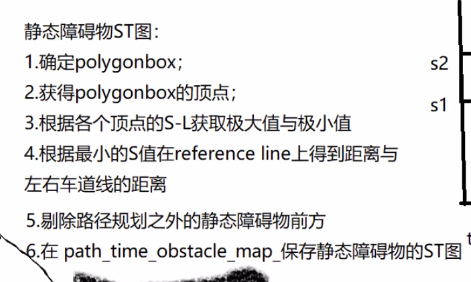
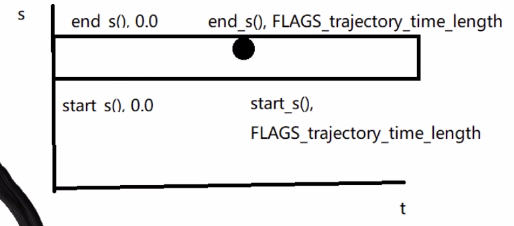
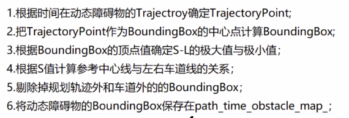
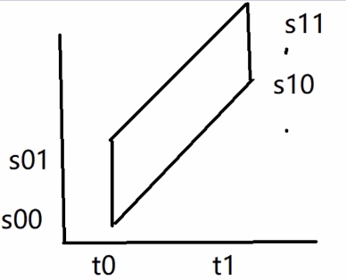

# PathTimeGraph

## 1.构造函数

函数功能：给成员变量赋值

obstacles：障碍物，静态或动态预测障碍物轨迹

discretized_ref_points: 离散的参考线点

ptr_reference_line_info: 

s_start: 规划曲线的起始距离s

s_end：规划曲线的终止点距离s

t_start: 规划曲线的起始时间t

t_end: 规划曲线的终止时间t

init_d: [d,d',d'']

```cpp
PathTimeGraph::PathTimeGraph(
    const std::vector<const Obstacle*>& obstacles,
    const std::vector<PathPoint>& discretized_ref_points,
    const ReferenceLineInfo* ptr_reference_line_info, const double s_start,
    const double s_end, const double t_start, const double t_end,
    const std::array<double, 3>& init_d) {
  CHECK_LT(s_start, s_end);
  CHECK_LT(t_start, t_end);
  path_range_.first = s_start;
  path_range_.second = s_end;
  time_range_.first = t_start;
  time_range_.second = t_end;
  ptr_reference_line_info_ = ptr_reference_line_info;
  init_d_ = init_d;

  SetupObstacles(obstacles, discretized_ref_points);
}
```

#### SetupObstacles()

函数功能：

对于动态障碍物和静态障碍物分别进行处理，

区分动态障碍物和静态障碍物的方法是看obstacle是否有轨迹，

```cpp
void PathTimeGraph::SetupObstacles(
    const std::vector<const Obstacle*>& obstacles,
    const std::vector<PathPoint>& discretized_ref_points) {
  for (const Obstacle* obstacle : obstacles) {
    if (obstacle->IsVirtual()) {
      continue;
    }
    if (!obstacle->HasTrajectory()) {
      SetStaticObstacle(obstacle, discretized_ref_points);
    } else {
      SetDynamicObstacle(obstacle, discretized_ref_points);
    }
  }

  std::sort(static_obs_sl_boundaries_.begin(), static_obs_sl_boundaries_.end(),
            [](const SLBoundary& sl0, const SLBoundary& sl1) {
              return sl0.start_s() < sl1.start_s();
            });

  for (auto& path_time_obstacle : path_time_obstacle_map_) {
    path_time_obstacles_.push_back(path_time_obstacle.second);
  }
}
```

#### SetStaticObstacle()

每一个obstacle都会有一个polygon多边形，如何根据obstacle把多边形做出来是个值得探讨的问题，

可以理解polygon是个凸集，如何根据polygon算凸集呢，也就是如何通过给的一堆点计算出凸集的问题。



```cpp
void PathTimeGraph::SetStaticObstacle(
    const Obstacle* obstacle,
    const std::vector<PathPoint>& discretized_ref_points) {
  const Polygon2d& polygon = obstacle->PerceptionPolygon();

  std::string obstacle_id = obstacle->Id();
    //计算sl_boundary,计算s的极大值和极小值，l的极大值和极小值
  SLBoundary sl_boundary =
      ComputeObstacleBoundary(polygon.GetAllVertices(), discretized_ref_points);

  double left_width = FLAGS_default_reference_line_width * 0.5;
  double right_width = FLAGS_default_reference_line_width * 0.5;
  ptr_reference_line_info_->reference_line().GetLaneWidth(
      sl_boundary.start_s(), &left_width, &right_width);
   /* path_range_.first = s_start (自车的位置的s，也就是规划的起点的s)
   *   path_range_.second = s_end （规划的终点位置的s）
   *   left_width ，考虑进障碍物的左边界
   *   right_width ，考虑进障碍物的右边界
   *  超过这些边界的障碍物就不考虑作为障碍物了
   */
  if (sl_boundary.start_s() > path_range_.second ||
      sl_boundary.end_s() < path_range_.first ||
      sl_boundary.start_l() > left_width ||
      sl_boundary.end_l() < -right_width) {
    ADEBUG << "Obstacle [" << obstacle_id << "] is out of range.";
    return;
  }
// 设置st图的左下，左上，右下，右上的st图顶点
  path_time_obstacle_map_[obstacle_id].set_id(obstacle_id);
  path_time_obstacle_map_[obstacle_id].set_bottom_left_point(
      SetPathTimePoint(obstacle_id, sl_boundary.start_s(), 0.0));
  path_time_obstacle_map_[obstacle_id].set_bottom_right_point(SetPathTimePoint(
      obstacle_id, sl_boundary.start_s(), FLAGS_trajectory_time_length));
  path_time_obstacle_map_[obstacle_id].set_upper_left_point(
      SetPathTimePoint(obstacle_id, sl_boundary.end_s(), 0.0));
  path_time_obstacle_map_[obstacle_id].set_upper_right_point(SetPathTimePoint(
      obstacle_id, sl_boundary.end_s(), FLAGS_trajectory_time_length));
  static_obs_sl_boundaries_.push_back(std::move(sl_boundary));
  ADEBUG << "ST-Graph mapping static obstacle: " << obstacle_id
         << ", start_s : " << sl_boundary.start_s()
         << ", end_s : " << sl_boundary.end_s()
         << ", start_l : " << sl_boundary.start_l()
         << ", end_l : " << sl_boundary.end_l();
}
```

静态障碍物的st图如下图所示，四个顶点分别为

(sl_boundary.start_s(),0),

( sl_boundary.end_s(),0) , 

(sl_boundary.start_s(), FLAGS_trajectory_time_length), 

(sl_boundary.end_s(), FLAGS_trajectory_time_length)



#### Polygon2d::ComputeConvexHull()

函数功能：通过多边形点，计算凸集（凸集是由很多顶点表示的），好像和决策规划没啥关系，应该是感知计算好的这个凸包顶点

```cpp
bool Polygon2d::ComputeConvexHull(const std::vector<Vec2d> &points,
                                  Polygon2d *const polygon) {
  CHECK_NOTNULL(polygon);
  const int n = static_cast<int>(points.size());
  if (n < 3) {  //如果polygon的点个数<3，那就是个线，肯定不能表示一个多边形
    return false;
  }
  std::vector<int> sorted_indices(n);
  for (int i = 0; i < n; ++i) {
    sorted_indices[i] = i;
  }
  std::sort(sorted_indices.begin(), sorted_indices.end(),
            [&](const int idx1, const int idx2) {
              const Vec2d &pt1 = points[idx1];
              const Vec2d &pt2 = points[idx2];
              const double dx = pt1.x() - pt2.x();
              if (std::abs(dx) > kMathEpsilon) {
                return dx < 0.0;
              }
              return pt1.y() < pt2.y();
            });
  int count = 0;
  std::vector<int> results;
  results.reserve(n);
  int last_count = 1;
  for (int i = 0; i < n + n; ++i) {
    if (i == n) {
      last_count = count;
    }
    const int idx = sorted_indices[(i < n) ? i : (n + n - 1 - i)];
    const Vec2d &pt = points[idx];
    while (count > last_count &&
           CrossProd(points[results[count - 2]], points[results[count - 1]],
                     pt) <= kMathEpsilon) {
      results.pop_back();
      --count;
    }
    results.push_back(idx);
    ++count;
  }
  --count;
  if (count < 3) {
    return false;
  }
  std::vector<Vec2d> result_points;
  result_points.reserve(count);
  for (int i = 0; i < count; ++i) {
    result_points.push_back(points[results[i]]);
  }
  *polygon = Polygon2d(result_points);
  return true;
}
```

#### SetDynamicObstacle()

函数功能：动态障碍物st图的构建

感觉应该是第一次障碍物在考虑范围内的时候设置左上和左下角点，然后以后在考虑范围内的话就设置右上和右下角点，当之后不在考虑范围内的话，右上和右下角点还保持上一次的设置，这样这四个点就构成了一个矩形，但是我咋有点不明白path_time_obstacle_map_.find(obstacle->Id()) !=
          path_time_obstacle_map_.end()的意思了呢？？？？？

 

```cpp
void PathTimeGraph::SetDynamicObstacle(
    const Obstacle* obstacle,
    const std::vector<PathPoint>& discretized_ref_points) {
      /* 对于动态障碍物，需要计算每个时间点的障碍物轨迹点
      * 时间段为[time_range_.first, time_range_.second]
      * 其中time_range_.first = 0, time_range_.second = FLAGS_trajectory_time_length
    */
  double relative_time = time_range_.first;
  while (relative_time < time_range_.second) {
    
    TrajectoryPoint point = obstacle->GetPointAtTime(relative_time);
    Box2d box = obstacle->GetBoundingBox(point);
    SLBoundary sl_boundary =
        ComputeObstacleBoundary(box.GetAllCorners(), discretized_ref_points);

    double left_width = FLAGS_default_reference_line_width * 0.5;
    double right_width = FLAGS_default_reference_line_width * 0.5;
    ptr_reference_line_info_->reference_line().GetLaneWidth(
        sl_boundary.start_s(), &left_width, &right_width);

    // The obstacle is not shown on the region to be considered.
    if (sl_boundary.start_s() > path_range_.second ||
        sl_boundary.end_s() < path_range_.first ||
        sl_boundary.start_l() > left_width ||
        sl_boundary.end_l() < -right_width) {
        //下面这句话是啥意思呢？？？这里放入的障碍物肯定是最后一个end()的啊，如果不等于end()那么说明，障碍物还没有出现在st图里，那么就应该把这个障碍物假如到st图里吧？？？，那为什么加break呢？那不就跳出循环了吗？？？如果不在考虑范围内，并且障碍物也没有出现在st图里，就break跳出循环？？？操，这是什么逻辑？我是不是想反了啊
      if (path_time_obstacle_map_.find(obstacle->Id()) !=
          path_time_obstacle_map_.end()) {
        break;
      }
      relative_time += FLAGS_trajectory_time_resolution;
      continue;
    }
   // 记录障碍物的id
      //当障碍物的id第一次出现时，记录障碍物的左下，和左上的st图的角点
    if (path_time_obstacle_map_.find(obstacle->Id()) ==
        path_time_obstacle_map_.end()) {
      path_time_obstacle_map_[obstacle->Id()].set_id(obstacle->Id());

      path_time_obstacle_map_[obstacle->Id()].set_bottom_left_point(
          SetPathTimePoint(obstacle->Id(), sl_boundary.start_s(),
                           relative_time));
      path_time_obstacle_map_[obstacle->Id()].set_upper_left_point(
          SetPathTimePoint(obstacle->Id(), sl_boundary.end_s(), relative_time));
    }

    path_time_obstacle_map_[obstacle->Id()].set_bottom_right_point(
        SetPathTimePoint(obstacle->Id(), sl_boundary.start_s(), relative_time));
    path_time_obstacle_map_[obstacle->Id()].set_upper_right_point(
        SetPathTimePoint(obstacle->Id(), sl_boundary.end_s(), relative_time));
    relative_time += FLAGS_trajectory_time_resolution;
  }
}
```

