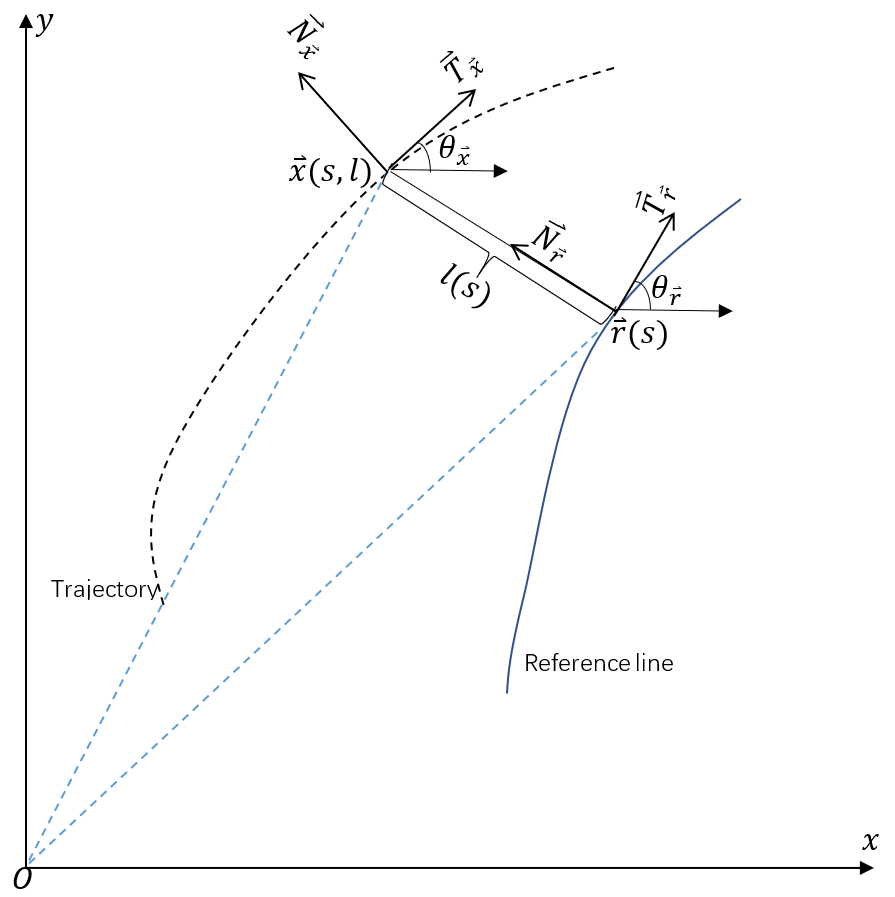

#  Apollo cartesian_frenet_convension

[参考资料1（这个推导比较细致）：blog.csdn.net/davidhopper/article/details/79162385](blog.csdn.net/davidhopper/article/details/79162385)

[参考资料2（这个给出了frenet-->cartesian的转换公式）：https://blog.csdn.net/u013468614/article/details/108748016](https://blog.csdn.net/u013468614/article/details/108748016)



## Cartesian转换到Frenet:

$$
l=±[(x_x-x_r)^2+(y_x-y_r)^2]   
$$
$$
if[(y-y_r)cos\theta_r)-(x-x_r)sin\theta_r]>0,+,otherwise,-.
$$

$$
l'=\frac{dl}{ds}=(1-k_rl)tan\Delta\theta
$$


$$
其中，\Delta\theta=\theta_x-\theta_r
$$

$$
l''=\frac{d^2l}{ds^2}=-(k'_rl+k_rl')tan\Delta\theta+\frac{1-k_rl}{cos^2\Delta\theta}(k_x\frac{1-k_rl}{cos\Delta\theta}-k_r)
$$

$$
s=s_r
$$

$$
\dot{s}=\frac{ds}{dt}=\frac{v_xcos\Delta\theta}{1-k_rl}
$$

$$
\ddot{s}=\frac{d^2s}{dt^2}=\frac{a_xcos\Delta\theta-\dot{s}^2[l'(k_x\frac{1-k_rl}{cos\Delta\theta}-k_r)-(k'_rl+k_rl')]}{1-k_rl}
$$

## Frenet转Cartesian:

$$
x_x=x_r-lsin(\theta_r)
$$

$$
y_x=y_r+lcos(\theta_r)
$$

$$
\theta_x=arctan(\frac{l'}{1-k_rl})+\theta_r  , \theta_x\in[-\pi,\pi]
$$

$$
v_x=\frac{(1-k_rl)\dot{s}}{cos\Delta\theta}=\sqrt{[\dot{s}(1-k_rl)]^2+(\dot{s}l')^2}
$$

$$
a_x=\ddot{s}\frac{1-k_rl}{cos\Delta\theta}+\frac{\dot{s}^2}{cos\Delta\theta}[l'(k_x\frac{1-k_rl}{cos\Delta\theta}-k_r)-(k'_rl+k_rl')]
$$

$$
k_x=[(l''+(k'_rl+k_rl')tan\Delta\theta)\frac{cos^2\Delta\theta}{1-k_rl}+k_r]\frac{cos\Delta\theta}{1-k_rl}
$$

**以上公式都是和Apollo中代码对应的**，推导过程见最前方的参考资料链接。

## 笛卡尔坐标系中曲率计算公式：

二维平面上的曲线有两种参数化形式，如下所示：

参数方程1：
$$
\begin{cases}
x_t=x(t) \\
y_t=y(t)
\end{cases}
$$
参数方程2：
$$
\begin{cases}
x_t=x_t \\
y_t=y(x_t)
\end{cases}
$$

那么问题来了，这两种参数方程的区别是什么呢？参数方程1的自变量是t，因变量是x和y，参数方程2的自变量是x，因变量是y。

曲率为角度对弧长的导数：

对于参数方程1：
$$
k=\frac{d\alpha}{ds}=\frac{y''x'-x''y'}{(x'^2+y'^2)^{\frac{3}{2}}}
$$
对于参数方程2：
$$
k=\frac{y''}{(1+y'^2)^{\frac{3}{2}}}
$$
曲率的导数计算公式为：（参考资料：[曲率对弧长的导数](https://blog.csdn.net/u013468614/article/details/108416552)）

对于参数方程1：
$$
k'=\frac{dk}{ds}=\frac{(y'''x'-x'''y')(x'^2+y'^2)-3(x'x''+y'y'')(y''x'-x''y')}{(x'^2+y'^2)^3}
$$

对于参数方程2：
$$
k'=\frac{y'''+y'''y'^2-3y'y''^2}{(1+y'^2)^3}
$$


## cartesian_frenet_conversion.h

```cpp
/******************************************************************************
 * Copyright 2018 The Apollo Authors. All Rights Reserved.
 *
 * Licensed under the Apache License, Version 2.0 (the "License");
 * you may not use this file except in compliance with the License.
 * You may obtain a copy of the License at
 *
 * http://www.apache.org/licenses/LICENSE-2.0
 *
 * Unless required by applicable law or agreed to in writing, software
 * distributed under the License is distributed on an "AS IS" BASIS,
 * WITHOUT WARRANTIES OR CONDITIONS OF ANY KIND, either express or implied.
 * See the License for the specific language governing permissions and
 * limitations under the License.
 *****************************************************************************/

/**
 * @file
 **/

#pragma once

#include <array>

#include "modules/common/math/vec2d.h"

namespace apollo {
namespace common {
namespace math {

// Notations:
// s_condition = [s, s_dot, s_ddot]
// s: longitudinal coordinate w.r.t reference line.
// s_dot: ds / dt
// s_ddot: d(s_dot) / dt
// d_condition = [d, d_prime, d_pprime]
// d: lateral coordinate w.r.t. reference line
// d_prime: dd / ds
// d_pprime: d(d_prime) / ds
// l: the same as d.
```

CartesianFrenetConverter:将笛卡尔坐标系中的车辆状态转换为Frenet坐标系。将二维运动解耦为两个独立相对于参考线的一维运动。横向移动是纵向累积距离s的函数，以更好地满足非完整约束。

```cpp
class CartesianFrenetConverter {
 public:
  CartesianFrenetConverter() = delete;
  /**
   * Convert a vehicle state in Cartesian frame to Frenet frame.
   * Decouple a 2d movement to two independent 1d movement w.r.t. reference
   * line.
   * The lateral movement is a function of longitudinal accumulated distance s
   * to achieve better satisfaction of nonholonomic constraints.
      */
```
cartesian_to_frenet():将笛卡尔坐标系转换到frenet坐标系的**两种方法**？

 ```cpp
    static void cartesian_to_frenet(const double rs, const double rx,
                                  const double ry, const double rtheta,
                                  const double rkappa, const double rdkappa,
                                  const double x, const double y,
                                  const double v, const double a,
                                  const double theta, const double kappa,
                                  std::array<double, 3>* const ptr_s_condition,
                                  std::array<double, 3>* const ptr_d_condition);
 ```

```cpp
  static void cartesian_to_frenet(const double rs, const double rx,
                                  const double ry, const double rtheta,
                                  const double x, const double y, double* ptr_s,
                                  double* ptr_d);
```

将Frenet坐标系中的车辆状态转换到笛卡尔坐标系下。结合两个相对于参考线的独立一维运动转化到一个二维运动。  

w.r.t：with respect to,关于。

```cpp
  /**
   * Convert a vehicle state in Frenet frame to Cartesian frame.
   * Combine two independent 1d movement w.r.t. reference line to a 2d movement.
      */
    static void frenet_to_cartesian(const double rs, const double rx,
                                  const double ry, const double rtheta,
                                  const double rkappa, const double rdkappa,
                                  const std::array<double, 3>& s_condition,
                                  const std::array<double, 3>& d_condition,
                                  double* const ptr_x, double* const ptr_y,
                                  double* const ptr_theta,
                                  double* const ptr_kappa, double* const ptr_v,
                                  double* const ptr_a);
```

CalculateTheta()：给定sl点坐标，提取x , y , theta(航向) , kappa(曲率).

```cpp
  // given sl point extract x, y, theta, kappa
  static double CalculateTheta(const double rtheta, const double rkappa,
                               const double l, const double dl);
```

```cpp
  static double CalculateKappa(const double rkappa, const double rdkappa,
                               const double l, const double dl,
                               const double ddl);
```

```cpp
  static Vec2d CalculateCartesianPoint(const double rtheta, const Vec2d& rpoint,
                                       const double l);
```

CalculateLateralDerivative()：给定sl，theta,道路航向角，曲率，提取l的导数，l的二阶导数。

```cpp
  /**
   * @brief: given sl, theta, and road's theta, kappa, extract derivative l,
      *second order derivative l:
      */
    static double CalculateLateralDerivative(const double theta_ref,
                                           const double theta, const double l,
                                           const double kappa_ref);
```

```cpp
  // given sl, theta, and road's theta, kappa, extract second order derivative
  static double CalculateSecondOrderLateralDerivative(
      const double theta_ref, const double theta, const double kappa_ref,
      const double kappa, const double dkappa_ref, const double l);
};

}  // namespace math
}  // namespace common
}  // namespace apollo

```


```cpp
/******************************************************************************
 * Copyright 2018 The Apollo Authors. All Rights Reserved.
 *
 * Licensed under the Apache License, Version 2.0 (the "License");
 * you may not use this file except in compliance with the License.
 * You may obtain a copy of the License at
 *
 * http://www.apache.org/licenses/LICENSE-2.0
 *
 * Unless required by applicable law or agreed to in writing, software
 * distributed under the License is distributed on an "AS IS" BASIS,
 * WITHOUT WARRANTIES OR CONDITIONS OF ANY KIND, either express or implied.
 * See the License for the specific language governing permissions and
 * limitations under the License.
 *****************************************************************************/

#include "modules/common/math/cartesian_frenet_conversion.h"

#include <cmath>

#include "cyber/common/log.h"
#include "modules/common/math/math_utils.h"

namespace apollo {
namespace common {
namespace math {
```
笛卡尔坐标转换为Frenet坐标

轨迹点已知点(x,y)，绝对速度v，绝对加速度a，航向角theta，曲率kappa。

参考线上的对应点的坐标为(rx, ry),对应的s为rs，航向角为rtheta,曲率rkappa,曲率的导数kdkappa。

ptr_s_condition？？？

ptr_d_condition：也即是sl中的l。

ptr_d_condition->at(0)：计算出来的d，
$$
l=±[(x_x-x_r)^2+(y_x-y_r)^2]
$$
ptr_d_condition->at(1)：计算出来的d‘，
$$
l'=\frac{dl}{ds}=(1-k_rl)tan\Delta\theta
$$


$$
\Delta\theta=\theta_x-\theta_r
$$

ptr_d_condition->at(2)：计算出来d'',
$$
l''=\frac{d^2l}{ds^2}=-(k'_rl+k_rl')tan\Delta\theta+\frac{1-k_rl}{cos^2\Delta\theta}(k_x\frac{1-k_rl}{cos\Delta\theta}-k_r)
$$
ptr_s_condition->at(0)：计算出的s，
$$
s=rs
$$
ptr_s_condition->at(1)：计算出的ds/dt
$$
\dot{s}=\frac{ds}{dt}=\frac{v_xcos\Delta\theta}{1-k_rl}
$$
ptr_s_condition->at(2)：计算出的d^2s/dt^2.
$$
\ddot{s}=\frac{d^2s}{dt^2}=\frac{a_xcos\Delta\theta-\dot{s}^2[l'(k_x\frac{1-k_rl}{cos\Delta\theta}-k_r)-(k'_rl+k_rl')]}{1-k_rl}
$$


```cpp

void CartesianFrenetConverter::cartesian_to_frenet(
    const double rs, const double rx, const double ry, const double rtheta,
    const double rkappa, const double rdkappa, const double x, const double y,
    const double v, const double a, const double theta, const double kappa,
    std::array<double, 3>* const ptr_s_condition,
    std::array<double, 3>* const ptr_d_condition) {
  const double dx = x - rx;
  const double dy = y - ry;

  const double cos_theta_r = std::cos(rtheta);
  const double sin_theta_r = std::sin(rtheta);

  const double cross_rd_nd = cos_theta_r * dy - sin_theta_r * dx;
  ptr_d_condition->at(0) =
      std::copysign(std::sqrt(dx * dx + dy * dy), cross_rd_nd);

  const double delta_theta = theta - rtheta;
  const double tan_delta_theta = std::tan(delta_theta);
  const double cos_delta_theta = std::cos(delta_theta);

  const double one_minus_kappa_r_d = 1 - rkappa * ptr_d_condition->at(0);
  ptr_d_condition->at(1) = one_minus_kappa_r_d * tan_delta_theta;

  const double kappa_r_d_prime =
      rdkappa * ptr_d_condition->at(0) + rkappa * ptr_d_condition->at(1);

  ptr_d_condition->at(2) =
      -kappa_r_d_prime * tan_delta_theta +
      one_minus_kappa_r_d / cos_delta_theta / cos_delta_theta *
          (kappa * one_minus_kappa_r_d / cos_delta_theta - rkappa);

  ptr_s_condition->at(0) = rs;

  ptr_s_condition->at(1) = v * cos_delta_theta / one_minus_kappa_r_d;

  const double delta_theta_prime =
      one_minus_kappa_r_d / cos_delta_theta * kappa - rkappa;
  ptr_s_condition->at(2) =
      (a * cos_delta_theta -
       ptr_s_condition->at(1) * ptr_s_condition->at(1) *
           (ptr_d_condition->at(1) * delta_theta_prime - kappa_r_d_prime)) /
      one_minus_kappa_r_d;
}
```
这个函数仅仅计算s和d。

```cpp
void CartesianFrenetConverter::cartesian_to_frenet(
    const double rs, const double rx, const double ry, const double rtheta,
    const double x, const double y, double* ptr_s, double* ptr_d) {
  const double dx = x - rx;
  const double dy = y - ry;

  const double cos_theta_r = std::cos(rtheta);
  const double sin_theta_r = std::sin(rtheta);

  const double cross_rd_nd = cos_theta_r * dy - sin_theta_r * dx;
  *ptr_d = std::copysign(std::sqrt(dx * dx + dy * dy), cross_rd_nd);
  *ptr_s = rs;
}
```
```cpp
void CartesianFrenetConverter::frenet_to_cartesian(
    const double rs, const double rx, const double ry, const double rtheta,
    const double rkappa, const double rdkappa,
    const std::array<double, 3>& s_condition,
    const std::array<double, 3>& d_condition, double* const ptr_x,
    double* const ptr_y, double* const ptr_theta, double* const ptr_kappa,
    double* const ptr_v, double* const ptr_a) {
  ACHECK(std::abs(rs - s_condition[0]) < 1.0e-6)
      << "The reference point s and s_condition[0] don't match";

  const double cos_theta_r = std::cos(rtheta);
  const double sin_theta_r = std::sin(rtheta);

  *ptr_x = rx - sin_theta_r * d_condition[0];
  *ptr_y = ry + cos_theta_r * d_condition[0];

  const double one_minus_kappa_r_d = 1 - rkappa * d_condition[0];

  const double tan_delta_theta = d_condition[1] / one_minus_kappa_r_d;
  const double delta_theta = std::atan2(d_condition[1], one_minus_kappa_r_d);
  const double cos_delta_theta = std::cos(delta_theta);

  *ptr_theta = NormalizeAngle(delta_theta + rtheta);

  const double kappa_r_d_prime =
      rdkappa * d_condition[0] + rkappa * d_condition[1];
  *ptr_kappa = (((d_condition[2] + kappa_r_d_prime * tan_delta_theta) *
                 cos_delta_theta * cos_delta_theta) /
                    (one_minus_kappa_r_d) +
                rkappa) *
               cos_delta_theta / (one_minus_kappa_r_d);

  const double d_dot = d_condition[1] * s_condition[1];
  *ptr_v = std::sqrt(one_minus_kappa_r_d * one_minus_kappa_r_d *
                         s_condition[1] * s_condition[1] +
                     d_dot * d_dot);

  const double delta_theta_prime =
      one_minus_kappa_r_d / cos_delta_theta * (*ptr_kappa) - rkappa;

  *ptr_a = s_condition[2] * one_minus_kappa_r_d / cos_delta_theta +
           s_condition[1] * s_condition[1] / cos_delta_theta *
               (d_condition[1] * delta_theta_prime - kappa_r_d_prime);
}
```
```cpp
double CartesianFrenetConverter::CalculateTheta(const double rtheta,
                                                const double rkappa,
                                                const double l,
                                                const double dl) {
  return NormalizeAngle(rtheta + std::atan2(dl, 1 - l * rkappa));
}
```
```cpp
double CartesianFrenetConverter::CalculateKappa(const double rkappa,
                                                const double rdkappa,
                                                const double l, const double dl,
                                                const double ddl) {
  double denominator = (dl * dl + (1 - l * rkappa) * (1 - l * rkappa));
  if (std::fabs(denominator) < 1e-8) {
    return 0.0;
  }
  denominator = std::pow(denominator, 1.5);
  const double numerator = rkappa + ddl - 2 * l * rkappa * rkappa -
                           l * ddl * rkappa + l * l * rkappa * rkappa * rkappa +
                           l * dl * rdkappa + 2 * dl * dl * rkappa;
  return numerator / denominator;
}
```
```cpp
Vec2d CartesianFrenetConverter::CalculateCartesianPoint(const double rtheta,
                                                        const Vec2d& rpoint,
                                                        const double l) {
  const double x = rpoint.x() - l * std::sin(rtheta);
  const double y = rpoint.y() + l * std::cos(rtheta);
  return Vec2d(x, y);
}
```
```cpp
double CartesianFrenetConverter::CalculateLateralDerivative(
    const double rtheta, const double theta, const double l,
    const double rkappa) {
  return (1 - rkappa * l) * std::tan(theta - rtheta);
}
```
```cpp
double CartesianFrenetConverter::CalculateSecondOrderLateralDerivative(
    const double rtheta, const double theta, const double rkappa,
    const double kappa, const double rdkappa, const double l) {
  const double dl = CalculateLateralDerivative(rtheta, theta, l, rkappa);
  const double theta_diff = theta - rtheta;
  const double cos_theta_diff = std::cos(theta_diff);
  const double res = -(rdkappa * l + rkappa * dl) * std::tan(theta - rtheta) +
                     (1 - rkappa * l) / (cos_theta_diff * cos_theta_diff) *
                         (kappa * (1 - rkappa * l) / cos_theta_diff - rkappa);
  if (std::isinf(res)) {
    AWARN << "result is inf when calculate second order lateral "
             "derivative. input values are rtheta:"
          << rtheta << " theta: " << theta << ", rkappa: " << rkappa
          << ", kappa: " << kappa << ", rdkappa: " << rdkappa << ", l: " << l
          << std::endl;
  }
  return res;
}

}  // namespace math
}  // namespace common
}  // namespace apollo

```

